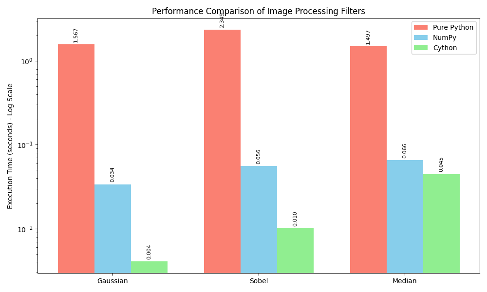
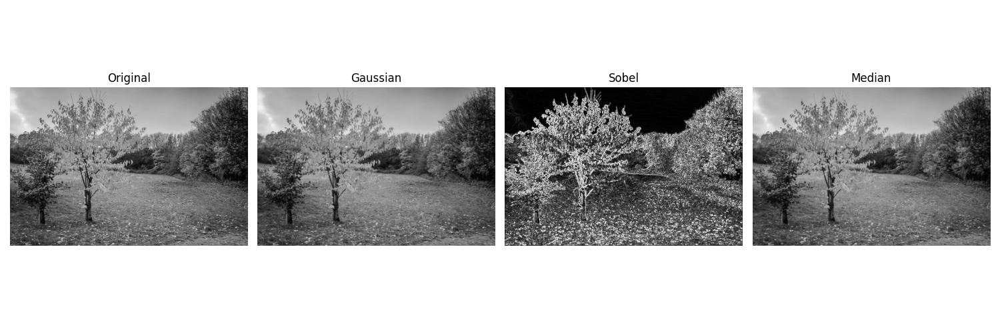

# Final Project Report: Image Processing Filtering Benchmark

**Course:** High Performance Computing  
**Professor:** José Francisco Pérez Alcocer  
**Institution:** Universidad Politécnica de Yucatán (UPY)  

---

## 1. Project Information

**Date:** March 13, 2026  
**Subject:** Performance Benchmarking of Computational Architectures  
**Authors:**
* Valeria Nicol Hernández León 
* José Ángel Pech Xool
* Iván Martin Romero Cetina

---

**Execution Timestamp:** 2026-03-10 06:29:38
**Image Resolution:** 1024 &times; 683 pixels
**Total Pixels Processed:** 699,392 pixels

## Abstract
This report evaluates the performance disparities across three distinct computational architectures tasked with generating mathematically identical convolutional image processing filters (Gaussian, Sobel, and Median). The computational efficiency is analyzed using Pure Python, NumPy vectorized operations, and NumPy combined with Cython (AOT-compiled C-extensions). The findings demonstrate the significant impact of the Global Interpreter Lock (GIL), memory access patterns, and compiler optimizations on CPU-bound spatial transformation tasks. This analysis was conducted for the High Performance Computing course under the instruction of Professor José Francisco Pérez Alcocer at the Universidad Politécnica de Yucatán (UPY).

## 1. Architectural Implementation Overview

### 1.1 Methodology Breakdown

- **Pure Python (`src/filters_python.py`)**: 
  - **Architecture:** Standard CPython interpretation utilizing high-level list objects and dynamic typing.
  - **Constraints:** Performance is severely bottlenecked by the Global Interpreter Lock (GIL), resulting in strictly sequential execution. The interpreter incurs continuous overhead from dynamic type-checking and object allocation for every pixel processed.

- **NumPy (`src/filters_numpy.py`)**: 
  - **Architecture:** Vectorized matrix operations utilizing pre-compiled C/Fortran backends.
  - **Optimization:** Exploits Single Instruction, Multiple Data (SIMD) capabilities and contiguous memory allocation, drastically reducing overhead compared to standard CPython loops.

- **NumPy + Cython (`src/filters_cython.pyx`)**: 
  - **Architecture:** Strictly-typed C-extensions compiled Ahead-of-Time (AOT).
  - **Optimization:** Circumvents Python interpreter overhead entirely within computational loops via typed memoryviews. Cython translates Python-like syntax into optimized C code, allowing direct pointer arithmetic and C-level loop unrolling.

## 2. Mathematical Context of Image Filters

Each filter algorithm serves a distinct spatial transformation objective:
1. **Gaussian Filter:** Applies a 2D Gaussian function kernel to smooth high-frequency noise by computing a weighted average of the surrounding spatial neighborhood.
2. **Sobel Operator:** Calculates the image gradient intensity at each pixel, effectively highlighting edges by computing discrete spatial derivatives in the horizontal and vertical domains.
3. **Median Filter:** A non-linear reduction filter that substitutes each pixel with the median value of its local neighborhood, widely utilized for decoupling 'salt-and-pepper' impulse noise while preserving structural edges.

## 3. Performance Analysis & Telemetry

### 3.1 Benchmark Execution Summary

| Filter Algorithm | Pure Python (s) | NumPy Vectorized (s) | Cython Optimized (s) | Speedup Factor (Py &rarr; Cy) |
| :--- | :--- | :--- | :--- | :--- |
| **Gaussian (Blur)** | 1.5665 | 0.0338 | 0.0041 | **&approx; 386.2&times;** |
| **Sobel (Edges)** | 2.3490 | 0.0558 | 0.0102 | **&approx; 231.1&times;** |
| **Median (Noise)** | 1.4968 | 0.0656 | 0.0448 | **&approx; 33.4&times;** |

**Visual Performance Graph:**

  

### 3.2 Computational Insights

1. **Interpreter Overhead & The GIL:** The pure Python implementation is a heavily compute-bound task throttled by object creation, reference counting, and dictionary lookups per pixel access. For an image of 1024 &times; 683, the interpreter evaluates millions of operations sequentially due to the GIL, resulting in severe instruction execution delays (high overhead).
2. **Contiguous Memory & Vectorization:** NumPy mitigates interpreter overhead by offloading operations to compiled C routines. However, vectorized sliding-window operations often require temporary array allocations (e.g., `np.pad`). While SIMD instructions boost Instruction-Level Parallelism (ILP), memory bandwidth can still act as a bottleneck.
3. **Memoryviews & Loop Unrolling:** Cython achieves the highest throughput by utilizing typed memoryviews (`double[:, :]`). This approach allows the C compiler to perform aggressive loop unrolling and direct pointer arithmetic. By accessing multidimensional arrays at the C level, Cython significantly improves spatial locality and reduces cache misses in the CPU's L1/L2 cache hierarchy, approaching the theoretical memory bandwidth limits of a single-threaded implementation.

## 4. Discussion: Execution Time vs. Ease of Implementation

The benchmark results illustrate a classic trade-off in High Performance Computing between execution speed and development effort:

- **Pure Python:** Offers the highest ease of implementation and rapid prototyping. The code is highly readable and requires no compilation steps or understanding of low-level memory management. However, its execution time is unfeasible for real-time or large-scale image processing.
- **NumPy:** Represents the optimal balance for most scientific computing tasks. It provides a highly abstracted, vectorized syntax that remains easy to implement while delivering order-of-magnitude improvements in execution time over pure Python. The primary challenge lies in formulating operations as matrix transformations rather than explicit loops.
- **Cython:** Delivers near C-level execution times but significantly increases implementation complexity. The developer must explicitly define static C types (e.g., using `cdef`), manage compiler directives (like disabling bounds checking and wraparound), and handle an Ahead-of-Time compilation step via `setup.py`. This introduces a steeper learning curve and debugging complexity comparable to C/C++, making it best suited for performance-critical bottlenecks where NumPy vectorization is insufficient.

## 5. Visual Fidelity Verification

Despite the architectural differences, the resulting transformations remain mathematically consistent across all implementations.

### 5.1 Output Samples
- **Gaussian Blur:** High-frequency spatial noise is mitigated.
- **Sobel Edges:** Structural gradients represent object contours with accurate precision.
- **Median Filter:** Impulse noise reduction achieved with high edge preservation.

  
   *(Figure 1: Cython-accelerated spatial transformations)*

## 6. Conclusion and Scalability Constraints

The empirical analysis validates that avoiding the Python interpreter loop via Cython yields a speedup of up to &approx; 386&times; for convolutional image processing. However, the current implementations remain constrained by single-thread CPU performance. According to Amdahl's Law, further performance gains on multi-core CPU architectures require minimizing the sequential portion of the code. 

**Future Scalability Recommendations:**
- **Shared-Memory Parallelization (OpenMP):** Implementing the `prange` directive in Cython to bypass the GIL entirely and distribute chunked loop iterations across available CPU cores.
- **Data-Parallel Architectures (CUDA/CuPy):** Transitioning from CPU-bound logic to highly parallel GPU hardware, converting the implementations from sequential memory accesses to massively parallel SIMT (Single Instruction, Multiple Threads) operations.
- **Cache Optimization:** Refactoring the convolution algorithms to strictly adhere to row-major memory access patterns, minimizing temporal and spatial cache misses.
